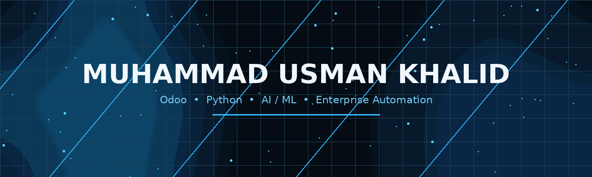

 

  

Odoo Developer · Python Developer · Aspiring AI/ML Engineer

 

## About

I build **Odoo systems, ERP automations, integrations, and reporting workflows** with a focus on turning business requirements into maintainable software.

- **Education:** BS Computer Science, UMT Lahore — 2025
- **Experience:** 2+ years working with Odoo development, ERP customization, and process automation
- **Focus:** Odoo architecture, Python, PostgreSQL, reporting, APIs, automation, and AI-assisted workflows
- **Exploring:** multi-tenant SaaS architecture and computer-vision integrations

> **Engineering principle:** understand the business workflow first; then design the data flow, security model, automation, and UI around it.

---

## What I Build

<table width="100%">
<tr>
<td width="50%" valign="top">

### 🧩 ERP & Odoo

 
 
 
 
 

</td>
<td width="50%" valign="top">

### 🤖 AI & Integrations

 
 
 
 
 

</td>
</tr>
</table>

---

## Tech Stack

  

 

---

## Selected Projects

<table width="100%">
<tr>
<td width="50%" valign="top">

### 🏢 Odoo Multi-Tenant SaaS

A multi-tenant Odoo setup with custom company branding, URL replacement, isolated tenant configuration, and a custom POS experience.

   

</td>
<td width="50%" valign="top">

### 👁️ Smart Vision Assist

A computer-vision concept combining object detection, OCR, and text-to-speech for interpreting visual information.

   

</td>
</tr>
<tr>
<td width="50%" valign="top">

### ⚙️ Process Automation System

End-to-end Odoo workflow automation connecting sales orders, delivery validation, and invoicing.

  

</td>
<td width="50%" valign="top">

### 📊 Financial Reporting Module

Dynamic financial reporting inside Odoo with filtering and data-driven report generation.

  

</td>
</tr>
<tr>
<td width="50%" valign="top">

### 📄 Document Automation

Automated generation of business documents and reports from Odoo data.

   

</td>
<td width="50%" valign="top">

</td>
</tr>
</table>

---

## How I Approach ERP Problems

<table width="100%">
<tr>
<td width="25%" align="center" valign="top">

### 🔍 Understand

Business process
Requirements
Existing behavior

</td>
<td width="25%" align="center" valign="top">

### 🧠 Design

Data flow
Architecture
Security rules

</td>
<td width="25%" align="center" valign="top">

### 🛠️ Build

Reusable modules
Automation
Reports / UI

</td>
<td width="25%" align="center" valign="top">

### ✅ Validate

Real data
Edge cases
User workflow

</td>
</tr>
</table>

`UNDERSTAND`  →  `DESIGN`  →  `BUILD`  →  `VALIDATE`  →  *(repeat as the process evolves)*

 

> The goal is not just to make an Odoo module work — it's to make the **business process simpler, traceable, and maintainable**.

---

## GitHub Activity

  

 

---

## Currently Exploring

 

 

---

## Let's Connect

  

Building · Automating · Learning

  

</document_content>
